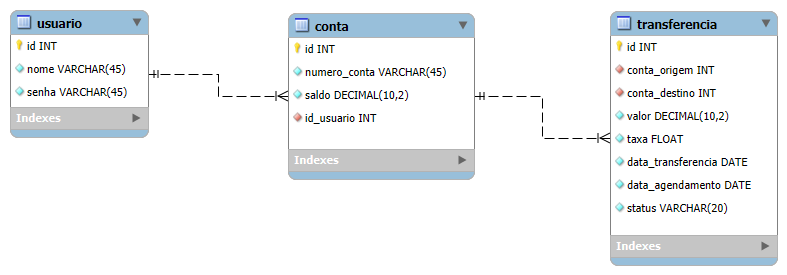
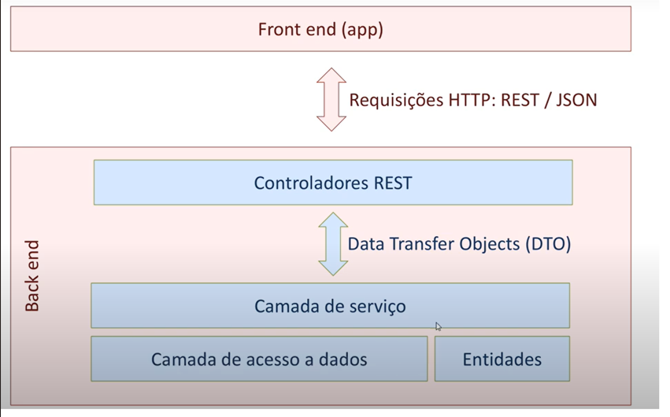

# 📌 Sistema de Agendamento de Transferências Financeiras  

## 📝 Descrição
Aplicação desenvolvida como avaliação prática. O sistema permite que o usuário agende transferências financeiras, aplicando regras de cálculo de taxa conforme a data da transferência. 

---
## 🗃️ Projeto

Este projeto é uma aplicação bancária simplificada com foco em operações de transferência entre contas, seguindo uma arquitetura em camadas.

1. Tabela usuario
   - Propósito: Autenticação e controle de acesso
2. Tabela conta
   - Propósito: Gerenciamento das contas bancárias
3. Tabela transferencia
   - Propósito: Registro de transações financeiras

## 🏗️ Arquitetura da Aplicação

Frontend (app)
- Interface para usuários finais
- Comunica via HTTP/REST com JSON como formato de dados

Backend - Camadas Arquiteturais
1. Controladores REST
- Expõem endpoints HTTP (GET, POST, PUT, DELETE)
- Recebem e validam requisições
- Devolvem respostas HTTP apropriadas

2. DTOs (Data Transfer Objects)
- Objetos para transferência de dados entre camadas
- Isolam a estrutura interna da entidade da API externa

3. Camada de Serviço

- Contém a lógica de negócio principal
- Valida regras (saldo suficiente, taxas, datas)
- Coordena transações entre múltiplas entidades

4. Camada de Acesso a Dados
- Gerencia persistência no banco de dados
- Utiliza entidades JPA/Hibernate que mapeiam tabelas
- Implementa operações CRUD e consultas customizadas


- **Backend**: Spring Boot (Java 11, H2 Database)  
- **Frontend**: Vue.js 3 + Vuetify  
- **Banco de Dados**: H2 em memória  

---

## ⚙️ Requisitos de instalação
Antes de começar, instale no seu computador:

- [Java 11](https://adoptium.net/temurin/releases/)  
- [Maven 3.8+](https://maven.apache.org/download.cgi)  
- [Node.js 18+](https://nodejs.org/en/download/)  
- [Yarn](https://classic.yarnpkg.com/lang/en/docs/install/) (opcional, pode usar npm)  
- Git  

---

## 📂 Estrutura do projeto
```
projeto-transferencias/
 ├── backend   # API em Spring Boot
 └── frontend  # Interface em Vue.js + Vuetify
```

---

## 🚀 Como executar o backend (Spring Boot)
1. Acesse a pasta do backend:  
   ```bash
   cd backend
   ```

2. Baixe as dependências e compile:  
   ```bash
   mvn clean install
   ```

3. Execute a aplicação:  
   ```bash
   mvn spring-boot:run
   ```

4. A API estará disponível em:  
   ```
   http://localhost:8080
   ```

5. Endpoints disponíveis:  
   - `POST /transferencias` → Agendar uma transferência  
   - `GET /transferencias` → Listar agendamentos  

6. Console do H2 Database (opcional):  
   ```
   http://localhost:8080/h2-console
   ```
   - JDBC URL: `jdbc:h2:mem:testdb`  
   - User: `sa`  
   - Password: (em branco)  

---

## 🎨 Como executar o frontend (Vue.js + Vuetify)
1. Acesse a pasta do frontend:  
   ```bash
   cd frontend
   ```

2. Instale as dependências:  
   ```bash
   yarn install
   ```
   ou  
   ```bash
   npm install
   ```

3. Execute o servidor de desenvolvimento:  
   ```bash
   yarn dev
   ```
   ou  
   ```bash
   npm run dev
   ```

4. Acesse no navegador:  
   ```
   http://localhost:3000   (Vue CLI)
   ```
> OBS. usar um navegador de teste com CORS desabilitado
---

## ✅ Testando no Postman
Exemplo de requisição **POST** para agendar transferência:

```json
{
  "contaOrigem": "1",
  "contaDestino": "2",
  "valor": 1000.00,
  "dataTransferencia": "2025-09-05"
}
```

Exemplo de resposta da API:
```json
{
  "id": 1,
  "contaOrigem": "1234567890",
  "contaDestino": "0987654321",
  "valor": 1000.00,
  "taxa": 12.00,
  "dataTransferencia": "2025-09-05",
  "dataAgendamento": "2025-08-27"
}
```

---

## 📦 Build para produção
- **Backend**: gera `.jar` executável  
  ```bash
  mvn clean package
  java -jar target/transfer-scheduler-backend-0.0.1-SNAPSHOT.jar
  ```
- **Frontend**: gera arquivos estáticos para deploy  
  ```bash
  yarn build
  ```
  Os arquivos estarão na pasta `dist/`.
